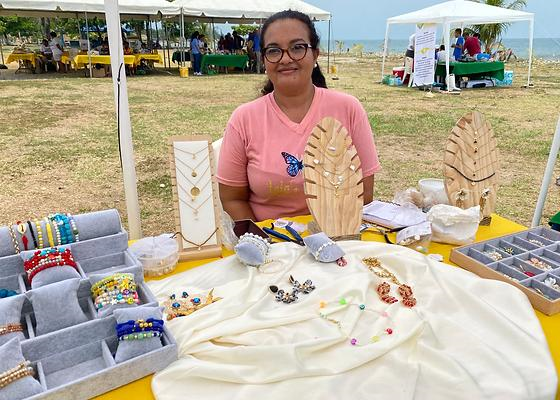
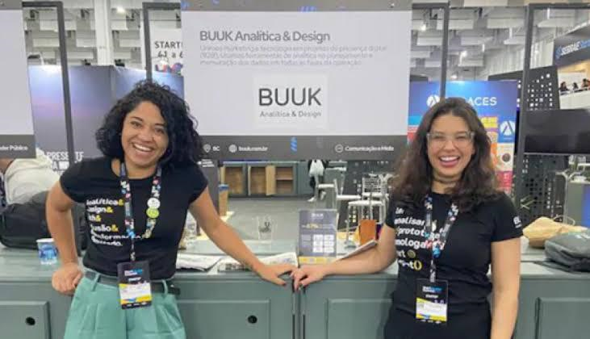
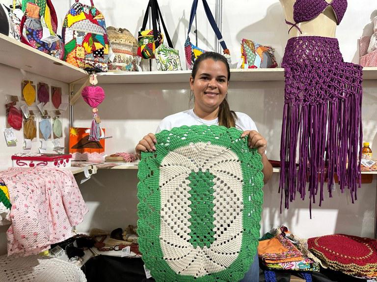

<link rel="stylesheet" href="https://cdnjs.cloudflare.com/ajax/libs/bootstrap-icons/1.10.5/font/bootstrap-icons.min.css">

  
Aqui estão as campanhas nas quais você pode apoiar.

 

  
  
<strong><i class="bi bi-building"></i> Nome:</strong> Campanha 1

  
<strong><i class="bi bi-info-circle"></i> Descrição:</strong> Ajude a transformar ideias em realidade e empoderar mulheres empreendedoras. Sua contribuição vai diretamente para apoiar startups lideradas por mulheres e projetos que promovem a igualdade de oportunidades. Juntos, podemos fazer a diferença, fomentar a inovação e criar um futuro mais inclusivo. Doe hoje e seja parte dessa transformação!

  
<strong><i class="bi bi-briefcase"></i> Categoria:</strong> Categoria 1

  <button href="" >APOIAR</button>

 

  
  
<strong><i class="bi bi-building"></i> Nome:</strong> Campanha 2

  
<strong><i class="bi bi-info-circle"></i> Descrição:</strong> Ajude a transformar ideias em realidade e empoderar mulheres empreendedoras. Sua contribuição vai diretamente para apoiar startups lideradas por mulheres e projetos que promovem a igualdade de oportunidades. Juntos, podemos fazer a diferença, fomentar a inovação e criar um futuro mais inclusivo. Doe hoje e seja parte dessa transformação!

  
<strong><i class="bi bi-briefcase"></i> Categoria:</strong> Categoria 2

  <button href="" >APOIAR</button>

 

  
  
<strong><i class="bi bi-building"></i> Nome:</strong> Campanha 3

  
<strong><i class="bi bi-info-circle"></i> Descrição:</strong> Ajude a transformar ideias em realidade e empoderar mulheres empreendedoras. Sua contribuição vai diretamente para apoiar startups lideradas por mulheres e projetos que promovem a igualdade de oportunidades. Juntos, podemos fazer a diferença, fomentar a inovação e criar um futuro mais inclusivo. Doe hoje e seja parte dessa transformação!

  
<strong><i class="bi bi-briefcase"></i> Categoria:</strong> Categoria 3

  <button href="" >APOIAR</button>

 

 
 
<strong><i class="bi bi-building"></i> Nome:</strong> Campanha 4

  
<strong><i class="bi bi-info-circle"></i> Descrição:</strong> Ajude a transformar ideias em realidade e empoderar mulheres empreendedoras. Sua contribuição vai diretamente para apoiar startups lideradas por mulheres e projetos que promovem a igualdade de oportunidades. Juntos, podemos fazer a diferença, fomentar a inovação e criar um futuro mais inclusivo. Doe hoje e seja parte dessa transformação!

<strong><i class="bi bi-briefcase"></i> Categoria:</strong> Categoria 4

<button href="" >APOIAR</button>

 

 
  
<strong><i class="bi bi-building"></i> Nome:</strong> Campanha 5

  
<strong><i class="bi bi-info-circle"></i> Descrição:</strong> Ajude a transformar ideias em realidade e empoderar mulheres empreendedoras. Sua contribuição vai diretamente para apoiar startups lideradas por mulheres e projetos que promovem a igualdade de oportunidades. Juntos, podemos fazer a diferença, fomentar a inovação e criar um futuro mais inclusivo. Doe hoje e seja parte dessa transformação!

  
<strong><i class="bi bi-briefcase"></i> Categoria:</strong> Categoria 5

  <button href="" >APOIAR</button>

<!-- Footer -->
<footer>

  
&copy; 2024 AURELIA. Todos os direitos reservados. <a href="">Política de Privacidade</a> | <a href="">Termos de Serviço</a>

 

  
Formas de Pagamento:

  
  
  
  
  

</footer>