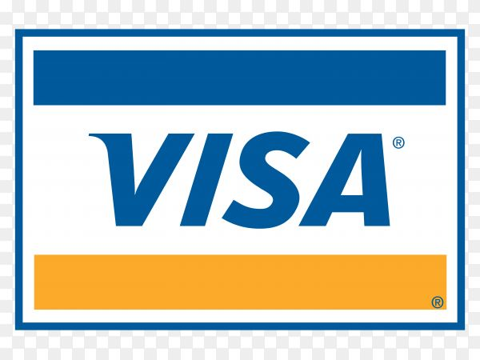

<link rel="stylesheet" href="https://cdnjs.cloudflare.com/ajax/libs/bootstrap-icons/1.10.5/font/bootstrap-icons.min.css">

  
Aqui estão as campanhas nas quais você pode apoiar.

 

  
  
<strong><i class="bi bi-building"></i> Nome:</strong> Cozinhando Sonhos: Apoie o Empreendimento da Ana

  
<strong><i class="bi bi-info-circle"></i> Descrição:</strong> Olá, sou a Ana, uma apaixonada pela culinária e mãe de dois filhos. Há três anos, decidi transformar minha paixão em um negócio, oferecendo pratos caseiros e deliciosos para a minha comunidade. Com muito amor e dedicação, consegui conquistar clientes fiéis, mas agora preciso da sua ajuda para dar o próximo passo.Com o crescimento das encomendas, percebi que para atender melhor meus clientes e expandir minha produção, preciso de utensílios adequados e melhorias na minha cozinha. 

Com um investimento de R$ 5.000, poderei adquirir:
Utensílios de qualidade (panelas, assadeiras, etc.)
Equipamentos para otimizar a produção
Matérias-primas frescas e locais

O apoio financeiro não só ajudará a aprimorar meu trabalho, mas também permitirá que eu ofereça melhores condições para a minha família. Cada contribuição é um passo rumo a um futuro mais próspero e sustentável.

Agradeço do fundo do coração a cada um que puder me apoiar nessa jornada. Juntos, podemos fazer a diferença!

Vamos cozinhar sonhos juntos?

Meta: R$ 5.000

  
<strong><i class="bi bi-briefcase"></i> Categoria:</strong> Negócios Locais

  <button href="" >APOIAR</button>

 

  
  
<strong><i class="bi bi-building"></i> Nome:</strong> Artesanato com Amor: Apoie a Criação da Luísa

  
<strong><i class="bi bi-info-circle"></i> Descrição:</strong> Olá, eu sou a Luísa, uma artesã apaixonada que transforma matérias-primas em peças únicas e cheias de personalidade. Há dois anos, comecei a vender minhas criações em feirinhas de rua, e a resposta da comunidade tem sido incrível! Cada peça é feita à mão com carinho, mas para levar meu trabalho a um novo nível, preciso da sua ajuda.
  
Com um investimento de R$ 4.000, poderei:

Adquirir materiais de melhor qualidade
Montar um estande mais profissional para as feirinhas
Aumentar meu estoque e diversificar as peças que ofereço
Seu apoio é fundamental para que eu possa continuar a criar e compartilhar meu amor pelo artesanato, além de garantir um futuro melhor para minha família. Cada contribuição é um passo em direção ao meu sonho de expandir esse negócio que tanto amo.

Agradeço de coração a todos que puderem me apoiar nessa jornada! Vamos juntos espalhar arte e amor!

Meta: R$ 4.000

  
<strong><i class="bi bi-briefcase"></i> Categoria:</strong> Artes

  <button href="" >APOIAR</button>

 

  
  
<strong><i class="bi bi-building"></i> Nome:</strong> Apoie o Sonho da Clara e da Jéssica

  
<strong><i class="bi bi-info-circle"></i> Descrição:</strong> AOlá, somos Clara e Jéssica, duas amigas e designers apaixonadas por transformar ideias em realidade. Desde que nos conhecemos na faculdade, sonhamos em criar uma marca que una criatividade e sustentabilidade. Agora, estamos prontas para dar o primeiro passo, mas precisamos da sua ajuda!

Com um investimento de R$ 6.000, queremos:

Desenvolver nossa linha de produtos sustentáveis (acessórios, moda, itens de decoração)
Criar um site para vender nossas criações
Participar de feiras e eventos de design para apresentar nosso trabalho
Acreditamos que o design pode ser uma força para o bem, e cada contribuição nos ajudará a trazer essa visão à vida. Seu apoio é fundamental para que possamos transformar nosso sonho em realidade e impactar positivamente nossa comunidade.

Agradecemos de coração a todos que puderem nos apoiar nessa jornada! Vamos juntos fazer a diferença através do design!

Apoie nossa paixão e ajude a criar um futuro mais sustentável!

Meta: R$ 6.000 

  
<strong><i class="bi bi-briefcase"></i> Categoria:</strong> Design

  <button href="" >APOIAR</button>

 

 
 
<strong><i class="bi bi-building"></i> Nome:</strong> Empoderamento em Rede: Ajude a Transformar Vidas

  
<strong><i class="bi bi-info-circle"></i> Descrição:</strong> Unidas pelo propósito de ajudar outras mulheres a gerenciar suas carreiras e alcançar seus objetivos. Acreditamos que, juntas, podemos construir um futuro mais empoderado e igualitário. Para isso, precisamos do seu apoio!

Com um investimento de R$ 8.000, planejamos:

Oferecer treinamentos e workshops focados em desenvolvimento pessoal e profissional
Criar materiais de apoio para auxiliar no traçar de metas e planos de carreira
Montar um programa de mentoria, conectando mulheres a profissionais experientes em diversas áreas
Seu apoio será fundamental para que possamos impactar a vida de muitas mulheres, fornecendo as ferramentas necessárias para que elas possam brilhar em suas carreiras. Cada contribuição ajudará a fortalecer essa rede de apoio e empoderamento.

Agradecemos de coração a todos que puderem nos ajudar nessa jornada! Vamos juntas transformar vidas!

Meta: R$ 8.000

<strong><i class="bi bi-briefcase"></i> Categoria:</strong>Desenvolvimento Pessoal

<button href="" >APOIAR</button>

 

 
  
<strong><i class="bi bi-building"></i> Nome:</strong> Crochê com Carinho: Apoie o Sonho da Mariana

  
<strong><i class="bi bi-info-circle"></i> Descrição:</strong> Mariana é uma artesã que cria peças em crochê feitas à mão, repletas de detalhes e carinho. Desde pequena, sempre teve uma paixão pela arte de crochetar e, nos últimos anos, transformou essa paixão em um negócio que a permite compartilhar sua criatividade com o mundo.

Para expandir sua produção e levar suas peças para mais pessoas, Mariana precisa de ajuda! Com um investimento de R$ 5.000, ela poderá:

Adquirir materiais de qualidade e sustentáveis
Montar estandes mais atraentes para feiras e exposições
Diversificar suas criações, trazendo novas ideias e designs
Seu apoio é essencial para que Mariana possa continuar a fazer o que ama e compartilhar sua arte com todos. Cada contribuição será um passo em direção ao sonho de uma carreira próspera e significativa.

Agradece de coração a todos que puderem ajudar nessa jornada! Vamos juntos valorizar o artesanato e a paixão pelo crochê!

Meta: R$ 5.000

  
<strong><i class="bi bi-briefcase"></i> Categoria:</strong> Artes

  <button href="" >APOIAR</button>

<!-- Footer -->
<footer>

  
&copy; 2024 AURELIA. Todos os direitos reservados. <a href="">Política de Privacidade</a> | <a href="">Termos de Serviço</a>

 

  
Formas de Pagamento:

  
  
  
  
  

</footer>