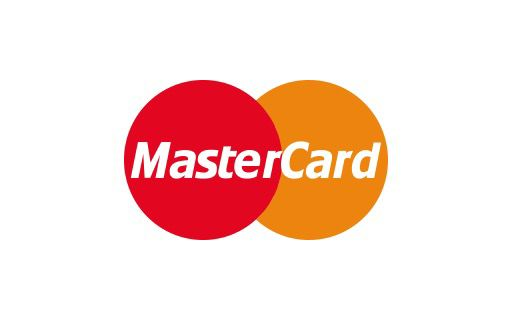

  
Cadastre aqui sua campanha de financiamento.

<!-- Seção de Formulário -->
<section>
  
  <form id="campaignForm">

   
  <label for="name">Nome da campanha:</label>
  <input type="text" id="name" name="name" required>

     
    

 
  <label for="informacoes">Descrição:</label>
  <textarea id="informacoes" name="informacoes" rows="8" required></textarea>

    
    

 
   <label for="categoria">Categoria:</label>
   <input type="categoria" id="categoria" name="categoria" required>

  
    
  <button type="submit">ENVIAR</button>

  </form>
</section>

<!-- Footer -->
<footer>

  
&copy; 2024 AURELIA. Todos os direitos reservados. <a href="">Política de Privacidade</a> | <a href="">Termos de Serviço</a>

 

  
Formas de Pagamento:

  
  
  
  
  

</footer>

