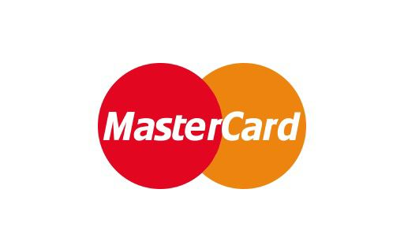

 

  

  
  

  

  <h2>SOBRE NÓS</h2>
   
  
Somos uma plataforma dedicada a apoiar ONGs ou empresas voltadas ao combate à desigualdade de gênero no Brasil, além de empresas comandadas por mulheres.

  
Nosso principal objetivo é reduzir a desigualdade de gênero e incentivar o empreendedorismo feminino no Brasil, facilitando o financiamento de projetos e empresas, a inclusão social e o combate à violência contra a mulher.

 

  
  <h4>PARA COLABORAR</h4>
   
  
Doe qualquer quantia e faça parte dessa campanha de incentivo às mulheres.

   
  <a href="campanhas.html" class="button">SEJA UM COLABORADOR</a>
   

  
  <h4>RECEBA NOSSO APOIO</h4>
   
  
Cadastre a campanha de sua ONG ou empresa e receba o incentivo financeiro e conhecimento que precisa.

   
  <a href="criarcampanha.html" class="button">CADASTRE SUA CAMPANHA</a>
   

  

<!-- Footer -->
<footer>

  
&copy; 2024 AURELIA. Todos os direitos reservados. <a href="">Política de Privacidade</a> | <a href="">Termos de Serviço</a>

 

  
Formas de Pagamento:

  
  
  
  
  

</footer>

